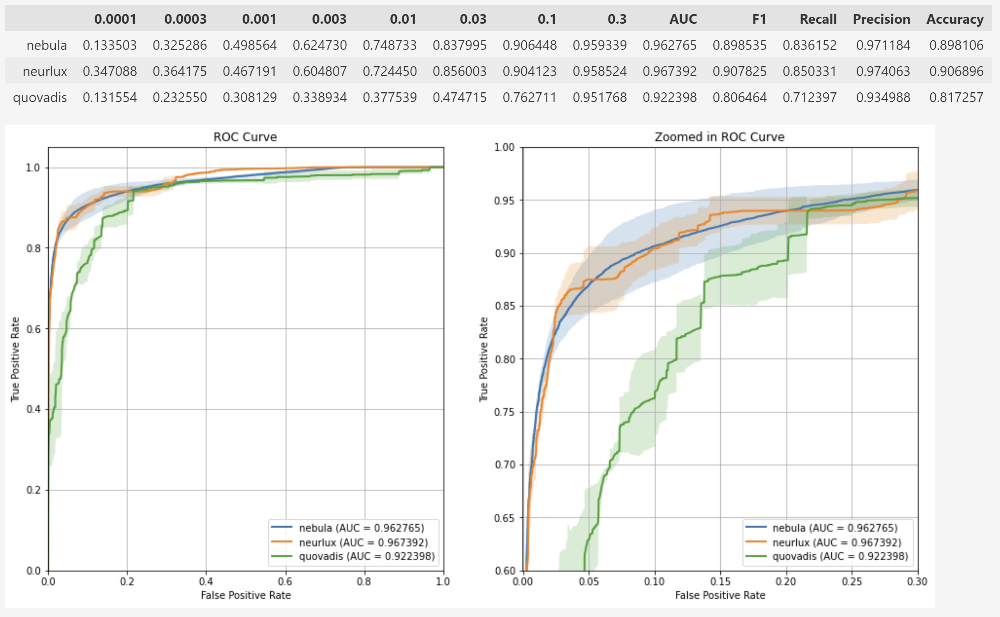
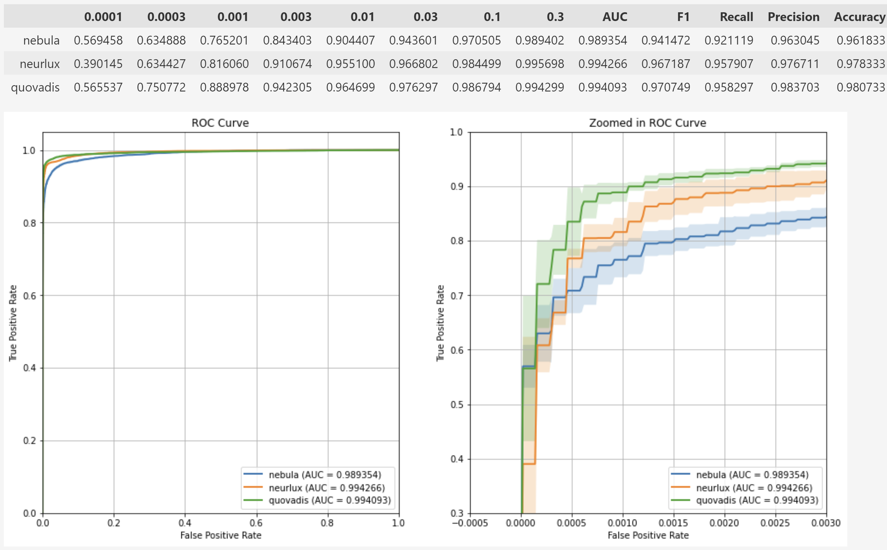

# State of the Art on Dynamic Analysis

Literature review revealed following papers in recent years (2019-2023) on dynamic analysis of malware:

1. IEEE DSAA 2021, <https://ieeexplore.ieee.org/stamp/stamp.jsp?tp=&arnumber=9564144>,  
**Combining Static and Dynamic Analysis to Improve Machine Learning-based Malware Classification**
    - no code
    - no data

2. AAAI 2020, <https://www.researchgate.net/publication/341872897_Dynamic_Malware_Analysis_with_Feature_Engineering_and_Feature_Learning>,  
**Dynamic Malware Analysis with Feature Engineering and Feature Learning**
    - no code
    - no data

3. IEEE TIFS 2022, <https://ieeexplore.ieee.org/stamp/stamp.jsp?tp=&arnumber=9715123>  
**CruParamer: Learning on Parameter-Augmented API Sequences for Malware Detection**
    - no code
    - data released

4. ACSAC 2019, <https://dl.acm.org/doi/abs/10.1145/3359789.3359835>,  
**Neurlux: dynamic malware analysis without feature engineering**
    - code released
    - no data

5. AISEC 2022, <https://dl.acm.org/doi/10.1145/3560830.3563726>,  
**Quo Vadis: Hybrid Machine Learning Meta-Model Based on Contextual and Behavioral Malware Representations**
    - code released
    - data released

-----------------
As it can be seen, only Neurlux and Quo Vadis can be replicated directly. Other paper has no code released, and replicating how they process dynamic reports from paper only is (a) error prone since preprocessing & feature engineering in all works is highly nuanced, (b) severely resource demanding because of (a).

One way to compare would be taking data, run our pipeline, and compare with results in original papers. But only paper #3, CruParamer, released data (however, poor quality, making it possible to compare only results on validation set).

Therefore 1-2 are not comparable, 3 - comparable (with remarks), and good comparison can be made with 4 and 5.

-----------------

## Quo Vadis (#5) data

## CruPamer (#3) data (only API calls)

