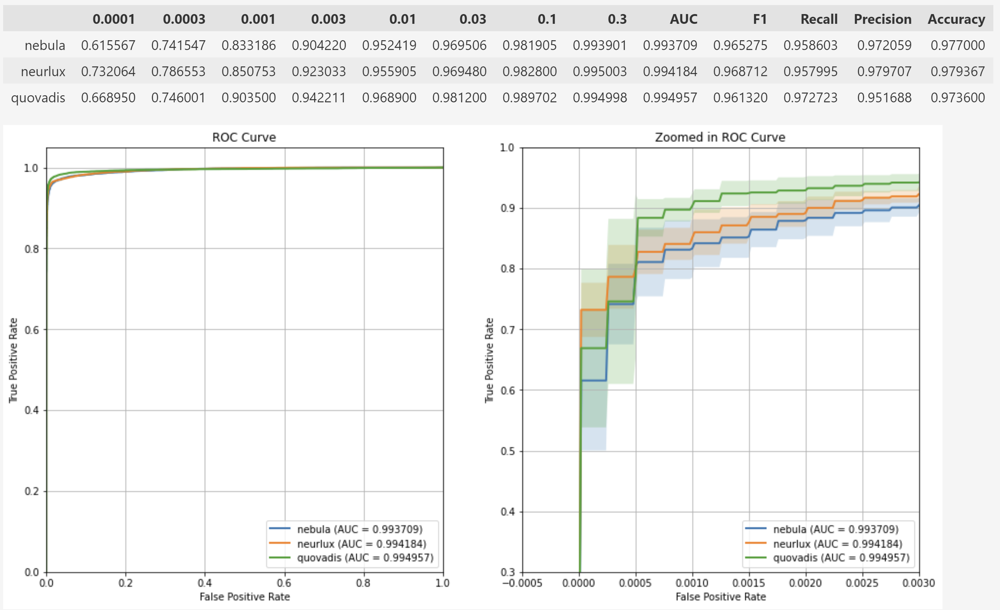

# State of the Art on Dynamic Analysis

Literature review revealed following papers in recent years (2019-2023) on dynamic analysis of malware:

1. ACSAC 2019, <https://dl.acm.org/doi/abs/10.1145/3359789.3359835>,  
**Neurlux: dynamic malware analysis without feature engineering**
    - code released
    - no data

2. AISEC 2022, <https://dl.acm.org/doi/10.1145/3560830.3563726>,  
**Quo Vadis: Hybrid Machine Learning Meta-Model Based on Contextual and Behavioral Malware Representations**
    - code released
    - data released

3. AAAI 2020, <https://www.researchgate.net/publication/341872897_Dynamic_Malware_Analysis_with_Feature_Engineering_and_Feature_Learning>,  
**Dynamic Malware Analysis with Feature Engineering and Feature Learning**
    - no public code (asked -- code provided)
    - no data (asked -- cannot share due to privacy policy)

4. IEEE TIFS 2022, <https://ieeexplore.ieee.org/stamp/stamp.jsp?tp=&arnumber=9715123>  
**CruParamer: Learning on Parameter-Augmented API Sequences for Malware Detection**
    - no public code (asked -- refused to share)
    - data: 3rd party dataset: <https://github.com/kericwy1337/Datacon2019-Malicious-Code-DataSet-Stage1>

5. IEEE DSAA 2021, <https://ieeexplore.ieee.org/stamp/stamp.jsp?tp=&arnumber=9564144>,  
**Combining Static and Dynamic Analysis to Improve Machine Learning-based Malware Classification**
    - no code
    - no data

6. arXiv, <https://arxiv.org/abs/2209.03188>,  
**Avast-CTU Public CAPE Dataset**
    - non-functional code
    - data released: <https://github.com/avast/avast-ctu-cape-dataset>

-----------------
_Summary_:

- Models: Neurlux [1], Quo Vadis [2], and gated-CNN model [3] can be replicated directly. Other paper has no code released and refused to do so after direct contact.
- Data: Quo Vadis [2] and Avast-CTU [6] are available. Data used in CruParamer [4] is published by 3rd part and available. Other papers have no data released.

-----------------

## Results

-----------------

## Quo Vadis [2] data

### **Test set (17407 samples): binary classification -- malicious vs. clean**


### **Validation set (25376 samples): binary classification -- malicious vs. clean**


### **Test set (17407 samples): multiclass -- 8 malware types**

Mean roc curve of 3 runs for each type vs. rest:


Metrics for each type vs. rest:

```text
clean
              0.01       AUC        F1    Recall  Precision  Accuracy
dmds      0.022942  0.748188  0.758818  0.899758   0.657691  0.736007
nebula    0.038209  0.855520  0.852634  0.963477   0.764701  0.846843
neurlux   0.034734  0.846400  0.845251  0.972889   0.747251  0.836234
quovadis  0.039514  0.838515  0.833750  0.911211   0.768742  0.832673

backdoor
              0.01       AUC        F1    Recall  Precision  Accuracy
dmds      0.410211  0.789360  0.686977  0.596220   0.861423  0.939450
nebula    0.785124  0.888982  0.854750  0.784364   0.939070  0.970280
neurlux   0.738174  0.866284  0.832900  0.736598   0.958201  0.967063
quovadis  0.774114  0.883894  0.852010  0.773024   0.949531  0.970050

coinminer
              0.01       AUC        F1    Recall  Precision  Accuracy
dmds      0.106564  0.785349  0.558558  0.642716   0.508632  0.900385
nebula    0.246825  0.770491  0.630264  0.565914   0.713992  0.935486
neurlux   0.491341  0.785783  0.691004  0.582740   0.849532  0.949541
quovadis  0.082952  0.723957  0.488396  0.510095   0.469035  0.896440

dropper
              0.01       AUC        F1    Recall  Precision  Accuracy
dmds      0.106260  0.690071  0.201513  0.420635   0.134615  0.951705
nebula    0.184617  0.709699  0.285044  0.444444   0.210562  0.967274
neurlux   0.443261  0.829410  0.448844  0.687831   0.361069  0.966891
quovadis  0.229852  0.794784  0.358026  0.616402   0.252407  0.968001

keylogger
              0.01       AUC        F1    Recall  Precision  Accuracy
dmds      0.052716  0.521524  0.079420  0.044188   0.780009  0.941767
nebula    0.030589  0.536186  0.129529  0.108870   0.160435  0.912392
neurlux   0.051865  0.569942  0.203185  0.173551   0.247921  0.918922
quovadis  0.038751  0.584788  0.211929  0.228947   0.197608  0.898068

ransomware
              0.01       AUC        F1    Recall  Precision  Accuracy
dmds      0.231809  0.611227  0.358425  0.229702   0.815745  0.898987
nebula    0.615397  0.804047  0.742148  0.613682   0.939576  0.947626
neurlux   0.396902  0.694877  0.552656  0.392395   0.953912  0.923019
quovadis  0.538453  0.765947  0.686104  0.535453   0.954726  0.939794

rat
              0.01       AUC        F1    Recall  Precision  Accuracy
dmds      0.009857  0.499928  0.000000  0.000000   0.000000  0.927596
nebula    0.242493  0.617133  0.368282  0.236619   0.882865  0.942648
neurlux   0.504413  0.749537  0.662516  0.499735   0.983478  0.963233
quovadis  0.059765  0.532584  0.119476  0.074457   0.513051  0.924494

trojan
              0.01       AUC        F1    Recall  Precision  Accuracy
dmds      0.148252  0.770502  0.528229  0.581879   0.490882  0.935524
nebula    0.241262  0.868782  0.682707  0.770125   0.613675  0.955095
neurlux   0.308709  0.825405  0.615327  0.691460   0.579782  0.942590
quovadis  0.165616  0.767423  0.535911  0.571778   0.519571  0.938588
```

### **Validation set (25376 samples): multiclass -- 8 malware types**

Mean roc curve of 3 runs for type vs. rest:


Metrics for each type vs. rest:

```text
clean
              0.01       AUC        F1    Recall  Precision  Accuracy
dmds      0.114002  0.920885  0.879307  0.932985   0.833872  0.916612
nebula    0.447454  0.972893  0.961305  0.967613   0.955102  0.974752
neurlux   0.348600  0.975635  0.960859  0.979979   0.942521  0.974109
quovadis  0.460534  0.958050  0.946272  0.936779   0.956065  0.965531

backdoor
              0.01       AUC        F1    Recall  Precision  Accuracy
dmds      0.697381  0.845552  0.805897  0.695558   0.965290  0.951974
nebula    0.774952  0.920938  0.896454  0.849543   0.951042  0.971587
neurlux   0.658602  0.922327  0.892895  0.854517   0.945415  0.970404
quovadis  0.789767  0.892371  0.871144  0.788416   0.973434  0.966122

coinminer
              0.01       AUC        F1    Recall  Precision  Accuracy
dmds      0.553021  0.891672  0.800972  0.804144   0.812683  0.963364
nebula    0.880392  0.937070  0.908294  0.879875   0.938765  0.983908
neurlux   0.893842  0.944493  0.922978  0.893131   0.956921  0.986549
quovadis  0.847713  0.928786  0.881135  0.867683   0.895225  0.978825

dropper
              0.01       AUC        F1    Recall  Precision  Accuracy
dmds      0.240735  0.879342  0.766491  0.792066   0.743064  0.947731
nebula    0.414818  0.948150  0.874186  0.918500   0.834079  0.971376
neurlux   0.450522  0.965908  0.889465  0.955439   0.834117  0.974096
quovadis  0.343377  0.959013  0.870353  0.945632   0.806202  0.969498

keylogger
              0.01       AUC        F1    Recall  Precision  Accuracy
dmds      0.460075  0.840283  0.717699  0.695039   0.760194  0.968894
nebula    0.568454  0.937636  0.829267  0.890994   0.775567  0.978917
neurlux   0.692548  0.950281  0.857623  0.913818   0.808230  0.982555
quovadis  0.364445  0.957668  0.796051  0.941163   0.689745  0.972270

ransomware
              0.01       AUC        F1    Recall  Precision  Accuracy
dmds      0.925158  0.958698  0.935647  0.924976   0.946635  0.983895
nebula    0.971318  0.983295  0.969864  0.971162   0.968608  0.992355
neurlux   0.960951  0.979314  0.973162  0.960616   0.986318  0.993301
quovadis  0.983908  0.990807  0.984401  0.983780   0.985024  0.996059

rat
              0.01       AUC        F1    Recall  Precision  Accuracy
dmds      0.038060  0.514170  0.052002  0.028393   0.308642  0.978247
nebula    0.417056  0.705336  0.561783  0.411907   0.883483  0.985655
neurlux   0.504666  0.749712  0.656389  0.499881   0.963319  0.988388
quovadis  0.286149  0.638676  0.368812  0.280696   0.821406  0.980611

trojan
              0.01       AUC        F1    Recall  Precision  Accuracy
dmds      0.125293  0.842519  0.689126  0.744911   0.641635  0.915640
nebula    0.226790  0.887843  0.785325  0.812607   0.761360  0.944198
neurlux   0.390303  0.882694  0.802180  0.790725   0.829100  0.951580
quovadis  0.200671  0.878805  0.766593  0.798253   0.739895  0.939127
```

## Avast-CTU [6] data (non-sequential sandbox report)

### **Malware Classification with 8 malware families -- mean results over 3-folds on validation set (12504 samples each)**


```text
Adload
               0.001       AUC        F1    Recall  Precision  Accuracy
nebula_bpe  0.968565  0.983976  0.968495  0.968549   0.968728  0.998827
nebula_wht  0.976790  0.988118  0.973789  0.976779   0.971022  0.999040
neurlux     0.992710  0.996324  0.995014  0.992702   0.997354  0.999813

Emotet
               0.001       AUC        F1    Recall  Precision  Accuracy
nebula_bpe  0.457241  0.996211  0.993550  0.996143   0.990996  0.996241
nebula_wht  0.260138  0.995812  0.992915  0.995685   0.990169  0.995868
neurlux     0.732856  0.996760  0.995727  0.994949   0.996508  0.997521

HarHar
               0.001       AUC        F1    Recall  Precision  Accuracy
nebula_bpe  0.996478  0.998183  0.994955  0.996475   0.993460  0.999840
nebula_wht  0.996478  0.998197  0.995791  0.996475   0.995127  0.999867
neurlux     1.000000  0.999959  0.997522  1.000000   0.995064  0.999920

Lokibot
               0.001       AUC        F1    Recall  Precision  Accuracy
nebula_bpe  0.323075  0.972931  0.956487  0.949597   0.963805  0.991896
nebula_wht  0.265549  0.978126  0.959456  0.960609   0.958683  0.992402
neurlux     0.528968  0.980991  0.972687  0.963835   0.981717  0.994935

Qakbot
               0.001       AUC        F1    Recall  Precision  Accuracy
nebula_bpe  0.986901  0.993250  0.991963  0.986893   0.997091  0.998081
nebula_wht  0.838728  0.993428  0.990575  0.987766   0.993419  0.997734
neurlux     0.994640  0.997092  0.995648  0.994638   0.996660  0.998960

Swisyn
               0.001       AUC        F1    Recall  Precision  Accuracy
nebula_bpe  0.997239  0.998532  0.998317  0.997236   0.999403  0.999254
nebula_wht  0.997844  0.998887  0.998799  0.997842   0.999759  0.999467
neurlux     0.999029  0.999445  0.999274  0.999028   0.999522  0.999680

Trickbot
               0.001       AUC        F1    Recall  Precision  Accuracy
nebula_bpe  0.661966  0.991297  0.982452  0.984211   0.980761  0.997308
nebula_wht  0.544557  0.992830  0.981291  0.987798   0.974914  0.997094
neurlux     0.608627  0.995354  0.985970  0.992411   0.979628  0.997841

Ursnif
               0.001       AUC        F1    Recall  Precision  Accuracy
nebula_bpe  0.734649  0.943527  0.917978  0.888146   0.950847  0.996428
nebula_wht  0.856959  0.956245  0.940655  0.913144   0.970055  0.997414
neurlux     0.952429  0.976061  0.969756  0.952394   0.987866  0.998667

Zeus
               0.001       AUC        F1    Recall  Precision  Accuracy
nebula_bpe  0.359265  0.963793  0.941133  0.930953   0.951817  0.992349
nebula_wht  0.401610  0.966278  0.947365  0.935294   0.960194  0.993229
neurlux     0.422805  0.981658  0.966280  0.965627   0.966955  0.995601

njRAT
               0.001       AUC        F1    Recall  Precision  Accuracy
nebula_bpe  0.134713  0.974953  0.932903  0.957658   0.910170  0.989630
nebula_wht  0.232811  0.972745  0.945043  0.950539   0.940385  0.991629
neurlux     0.233042  0.985759  0.960608  0.976071   0.945828  0.993975
```

### **Malware Classification with 8 malware families -- mean results over 3-folds on test set (11464 samples)**


```text
Adload
               0.001       AUC        F1    Recall  Precision  Accuracy
nebula_bpe  0.544652  0.865998  0.439000  0.733333   0.451754  0.998546
nebula_wht  0.824753  0.966390  0.697531  0.933333   0.647186  0.999418
neurlux     0.731407  0.999142  0.714976  1.000000   0.692708  0.998284

Emotet
               0.001       AUC        F1    Recall  Precision  Accuracy
nebula_bpe  0.180619  0.945309  0.939160  0.895910   0.986935  0.964294
nebula_wht  0.453669  0.938136  0.931919  0.880136   0.990376  0.960427
neurlux     0.724392  0.934505  0.929410  0.869935   0.997615  0.959322

HarHar
               0.001       AUC        F1    Recall  Precision  Accuracy
nebula_bpe  0.666984  0.833319  0.776261  0.666667   0.989583  0.997965
nebula_wht  0.739391  0.869565  0.836308  0.739130   1.000000  0.998430
neurlux     0.869652  0.934666  0.903125  0.869565   0.953704  0.998982

Lokibot
               0.001       AUC        F1    Recall  Precision  Accuracy
nebula_bpe  0.158345  0.949921  0.895719  0.907543   0.886545  0.987235
nebula_wht  0.280204  0.956112  0.904769  0.919708   0.896324  0.988166
neurlux     0.069670  0.943042  0.831987  0.903650   0.774374  0.977727

Qakbot
               0.001       AUC        F1    Recall  Precision  Accuracy
nebula_bpe  0.983898  0.991792  0.987645  0.983885   0.991573  0.999157
nebula_wht  0.750479  0.995476  0.976850  0.992366   0.962210  0.998372
neurlux     0.417193  0.994472  0.931980  0.994063   0.880955  0.994853

Swisyn
               0.001       AUC        F1    Recall  Precision  Accuracy
nebula_bpe  0.739623  0.997788  0.997263  0.997103   0.997428  0.997965
nebula_wht  0.997184  0.998475  0.998393  0.997182   0.999608  0.998808
neurlux     0.998670  0.999173  0.999060  0.998669   0.999452  0.999302

Trickbot
               0.001       AUC        F1    Recall  Precision  Accuracy
nebula_bpe  0.057277  0.974917  0.922726  0.966816   0.882631  0.981129
nebula_wht  0.038899  0.981101  0.905574  0.987774   0.836151  0.975983
neurlux     0.113719  0.981093  0.953570  0.970808   0.936949  0.988980

Ursnif
               0.001       AUC        F1    Recall  Precision  Accuracy
nebula_bpe  0.730695  0.953167  0.936244  0.907703   0.968785  0.994650
nebula_wht  0.787486  0.968366  0.958477  0.937583   0.980967  0.996453
neurlux     0.828745  0.913993  0.890989  0.828685   0.981508  0.991829

Zeus
               0.001       AUC        F1    Recall  Precision  Accuracy
nebula_bpe  0.100721  0.917021  0.641870  0.844907   0.533110  0.987323
nebula_wht  0.100031  0.919224  0.669049  0.847222   0.554419  0.989416
neurlux     0.081057  0.953675  0.650305  0.918981   0.504552  0.987497

njRAT
               0.001       AUC        F1    Recall  Precision  Accuracy
nebula_bpe  0.077985  0.974453  0.865629  0.961940   0.788423  0.985782
nebula_wht  0.126338  0.971604  0.889586  0.952732   0.837892  0.988689
neurlux     0.063269  0.982690  0.847869  0.982198   0.747500  0.983136

```

## CruPamer [4] data (only API calls & arguments)

### **Binary -- clean vs. malicious -- mean results over 5 folds on validation sets (6000 samples each):**



-----------------

Note:

Preprocessing from gated-CNN paper \[3\] takes ~100 hours for CruParamer \[5\] data:

```text
2023-03-27 08:10:24,196 WARNING  [*] Parsing malicious reports...
[16:12<00:00, 10.28it/s] 
2023-03-27 08:26:37,438 WARNING  [*] Parsing benign reports...
[09:02<00:00, 36.88it/s] 
2023-03-27 08:35:40,731 WARNING  [*] Parsing test reports...
[18:23<00:00, 13.60it/s]

2023-03-27 08:54:04,809 WARNING  [!] Working on dmds train preprocessing...
... 224/30000 [22:41<100:53:14, 12.20s/it] 
```

Skipped...
